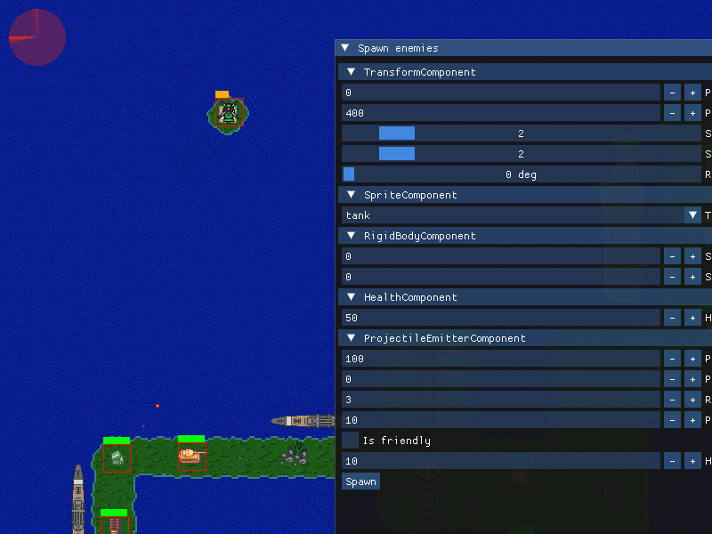

## Hi there 👋

I'm Ninad Sachania and I'm currently a Senior Software Engineer at a bank, where I mainly work on high-volume data processing.

In my free time, I contribute to open-source projects and develop games.

## Open Source

### SerenityOS

I've contributed the most to SerenityOS, a hobbyist Unix-like OS. Contributions [here](https://github.com/SerenityOS/serenity/pulls?q=is%3Apr+author%3Aninadsachania+is%3Aclosed+is%3Amerged).

### Jubin's 8085 Simulator

I have been working on improvements to Jubin's 8085 Simulator. Improvements [here](https://github.com/8085simulator/8085simulator/compare/master...ninadsachania:8085simulator:master).

### Other Contributions

I've also made smaller contributions to other projects. Contributions [here](https://github.com/raysan5/raylib-games/pulls?q=is%3Apr+author%3Aninadsachania+is%3Aclosed), [here](https://github.com/raysan5/raylib/pulls?q=is%3Apr+author%3Aninadsachania+is%3Aclosed), and [here](https://github.com/jart/bestline/pulls?q=is%3Apr+author%3Aninadsachania+is%3Aclosed).

## Projects

### Game Engine

I wrote a 2D game using C++ and SDL2. I wrote a custom engine and an ECS framework for it. I also integrated Dear ImGui for developer tools and added Lua for scripting gameplay code.

Here's a screenshot of the game:

Yes, I know that ECS and Lua are overkill for this game, but this game was an exercise in learning how to make games using tools and techniques that most developers and studios use.

To atone for my sins, I am rewriting the game in C-style C++ and raylib :-)

### CHIP-8 Emulator

I built a CHIP-8 emulator in Jai and raylib. Repo [link](https://github.com/ninadsachania/chip-8-jai).

### E-HealthCard

I built an app to digitize medical records in India. Repo [link](https://github.com/ninadsachania/e-healthcard). 

### 8085 Simulator

I am building a simulator for Intel's 8085 microprocessor in C++ and Dear ImGui. Repo [link](https://github.com/ninadsachania/intel-8085-sim).

### Piotr Pushowski and the Crates

I am porting _Piotr Pushowski and the Crates_ from Jai and Simp to Odin and raylib. Repo [link](https://github.com/ninadsachania/piotr-pushowski-odin).

### Game of Life

I built Conway's Game of Life in Jai and raylib. Repo [link](https://github.com/ninadsachania/game-of-life-jai).

### Little Man Computer

I am building a simulator for the Little Man Computer in Jai and Dear ImGui. Repo [link](https://github.com/ninadsachania/lmc). 

### Miscellaneous Projects

- A [clone](https://github.com/ninadsachania/snake-game-jai) of the classic game Snake.
- A recursion [exercise](https://github.com/ninadsachania/snowflake-recursion).

## Other Stuff

I take courses that are buried deep in the bowels of the internet, clean them, and upload them to YouTube for preservation purposes. For example, Donald Knuth once gave a course called _Mathematical Writing_ that was originally on tape. I found the digitized recordings and uploaded them to YouTube. I also hunted down all the references—books, papers, and other material—mentioned in the lectures and put them in the descriptions. Here's the [link](https://www.youtube.com/playlist?list=PLOdeqCXq1tXihn5KmyB2YTOqgxaUkcNYG) to the playlist.

## Where to Find Me

- [GitHub](https://github.com/ninadsachania)
- [Twitter](https://x.com/ninadsachania)
- [YouTube](https://www.youtube.com/@ninadsachania/videos)
- [LinkedIn](https://www.linkedin.com/in/ninadsachania/)
